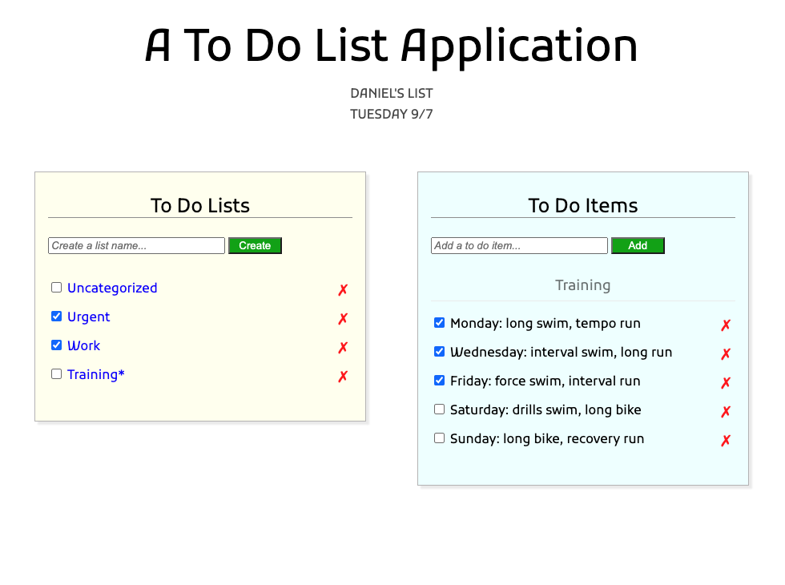

# To Do List Application

This was the first project in the [Udacity](https://udacity.com) Full Stack nanodegree. It's a simple to do app that includes functionality to create to do lists and to create to do items within a to do list.

### Functionality Built in Tutorial
- Basic ability to CRUD to do items
- Database relationship between a to do item and a to do list
- Simple index view with embedded styles and scripts
- Simple controller with ability to add, delete and complete to do items

### Functionality Added Independent of Udacity Tutorial
- Feature 1 [x]: add a feature that allows the user to create a new to do list
- Feature 2 [x]: add a checkbox to each to do list that marks all of that lists' to do items as completed
- Feature 3 [x]: add a delete button (x) to each list; deleting a list should delete all associated to do items
- Udacity Bugs
  - Bug 1 [x]: to do item creation was broken after adding the list association
  - Bug 2 [x]: creating an item or a list results in the element showing up but its checkbox and delete buttons not being active
  - Bug 3 [ ]: the app shouldn't allow blank items or lists
  - Bug 4 [x]: checkboxes don't show up until after refresh when creating a new list
  - Bug 5 [ ]: the behavior of complete all items in a list needs further testing (i.e. what happens when we uncheck the list? Should all items become unchecked or should it revert to some previous state?)
  - Bug 6 [x]: when you add a list, it doesn't add it as a link
- Update 1 [x]: style the page (positioning, background and borders, width)
- Update 2 [x]: add a readme file that tracks the difference between the Udacity basic app and this version along with any bugs
- Update 3 [x]: add a screenshot of the app in the readme file

